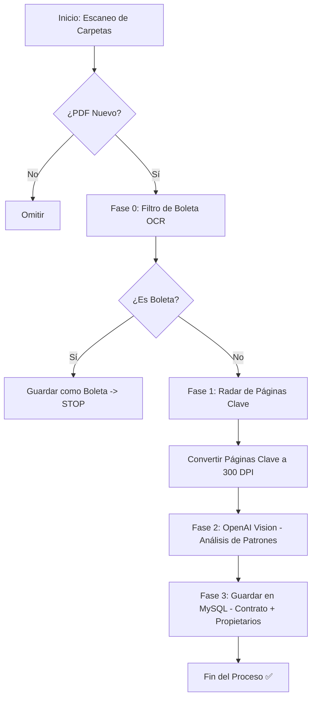

# 📋 DOCUMENTACIÓN DEL FLUJO — Sistema Aybar Vision Premium

**Proyecto**: Automatización de extracción de datos contractuales  
**Empresa**: AYBAR CORP S.A.C.  
**Tecnologías**: Python + OpenAI Vision (GPT-4o) + Tesseract OCR + MySQL

---

## 🔄 Resumen Ejecutivo del Flujo
El sistema está diseñado para convertir carpetas llenas de PDFs en datos estructurados dentro de una base de datos. A diferencia de un OCR tradicional, este sistema emula el criterio de un analista humano: recorre carpetas, descarta boletas y busca inteligentemente las cláusulas de entrega y datos de propietarios.

---

## 🛠️ Paso 1: Recorrido y Filtrado Inicial

### 1.1 Recorrido Recursivo de Carpetas
El script utiliza `os.walk()` para recorrer la carpeta raíz (`CARPETA_PDF`) y **todas sus subcarpetas**. Esto permite organizar los archivos por año, proyecto o estado sin perder la capacidad de procesamiento.

### 1.2 Filtro de Seguridad (Anti-Boletas)
Para evitar costos innecesarios en la API de OpenAI, el sistema aplica un filtro rápido local:
*   Extrae el texto de la **Página 1** usando `pytesseract`.
*   Si detecta palabras como `"BOLETA DE VENTA"`, marca el archivo como `boleta` en la base de datos y detiene el proceso premium inmediatamente.

---

## 🎯 Paso 2: El "Sistema de Radar" (Detección de Páginas)

Los contratos pueden tener 20, 30 o más páginas, pero la información valiosa suele estar dispersa. Para optimizar el tiempo y los tokens, el script implementa un **Radar**:

1.  **Escaneo de Bajo Costo (130 DPI):** Convierte todo el PDF a imágenes de resolución media para una lectura rápida.
2.  **Detección de Patrones Clave:** Busca en el texto de cada página palabras como:
    *   `ANEXO 1`, `INFORMACIÓN DEL CLIENTE`, `MEMORIA DESCRIPTIVA`.
    *   `FORMALIZACIÓN`, `POSESIÓN`, `CONTRATO DEFINITIVO`.
    *   `VIII`, `VII` (Secciones de entrega).
3.  **Selección Inteligente:** Solo las páginas que contienen estas palabras (más la primera y la última por seguridad) son enviadas a la IA en **Alta Resolución (300 DPI)**.

---

## 🤖 Paso 3: Análisis Vision Premium (OpenAI GPT-4o)

Las páginas seleccionadas por el radar se envían a la IA con un conjunto de reglas de negocio estrictas (Mapa de Patrones):

### 3.1 Mapa de Patrones de Entrega
La IA está entrenada mediante el prompt para buscar la `fecha_entrega` siguiendo 6 patrones específicos (A-F):
*   **Patrones de Cláusula:** Busca frases como *"se realizara en [MES] de [AÑO]"* en la cláusula Quinta o Sexta.
*   **Patrones de Anexo:** Si el texto dice *"según Anexo 1"*, la IA ignora el texto y busca directamente los cuadros técnicos al final del documento.
*   **Prioridad Manuscrita:** Si existe un cambio escrito a mano (lapicero) sobre el texto impreso, la IA prioriza el valor manuscrito.

### 3.2 Extracción de Copropietarios
El sistema no solo extrae al titular, sino que recorre el Punto II del Anexo 1 para identificar a todos los copropietarios (Cónyuges, socios), extrayendo sus nombres y DNIs de forma estructurada.

---

## � Paso 4: Persistencia y Auditoría (MySQL)

Una vez que la IA devuelve el JSON, el sistema realiza el guardado:

1.  **Tabla Principal (`contratos_digitalizados`):** Guarda datos del lote, proyecto, área, alícuota y las dos fechas críticas (Suscripción y Entrega).
2.  **Tabla Secundaria (`contrato_propietarios`):** Crea una fila por cada persona encontrada en el contrato, vinculada al ID principal.
3.  **Auditoría de Costos:** Se guarda el consumo de tokens y el costo en USD de cada documento procesado.
4.  **Texto OCR:** Se guarda un fragmento del texto extraído para futuras búsquedas rápidas.

---

## 📊 Arquitectura de Archivos

```
automatizacion/
├── vision_aybar_premium.py  # Orquestador: Radar, Vision y DB
├── check_db.py              # Monitor: Verifica los últimos registros y costos
├── manuales/
│   ├── TABLA_ENTRENAR.md    # Guía de patrones visuales para la IA
│   ├── MANUAL_TECNICO.md    # Especificaciones de ingeniería
│   └── GUIA_USO.md          # Manual para el operador final
├── .env                     # Credenciales y rutas de carpetas
└── entrenar/                # Carpeta raíz con PDFs (incluye subcarpetas)
```

---

## � Resumen del Flujo de Datos


